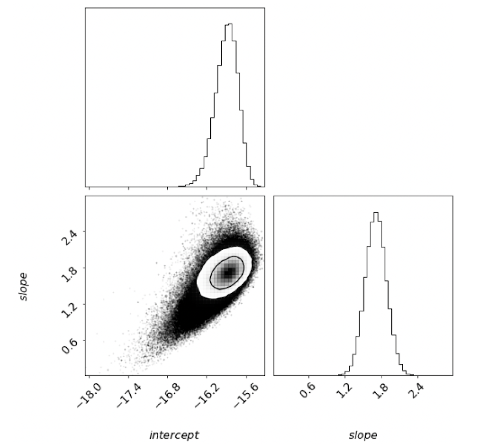
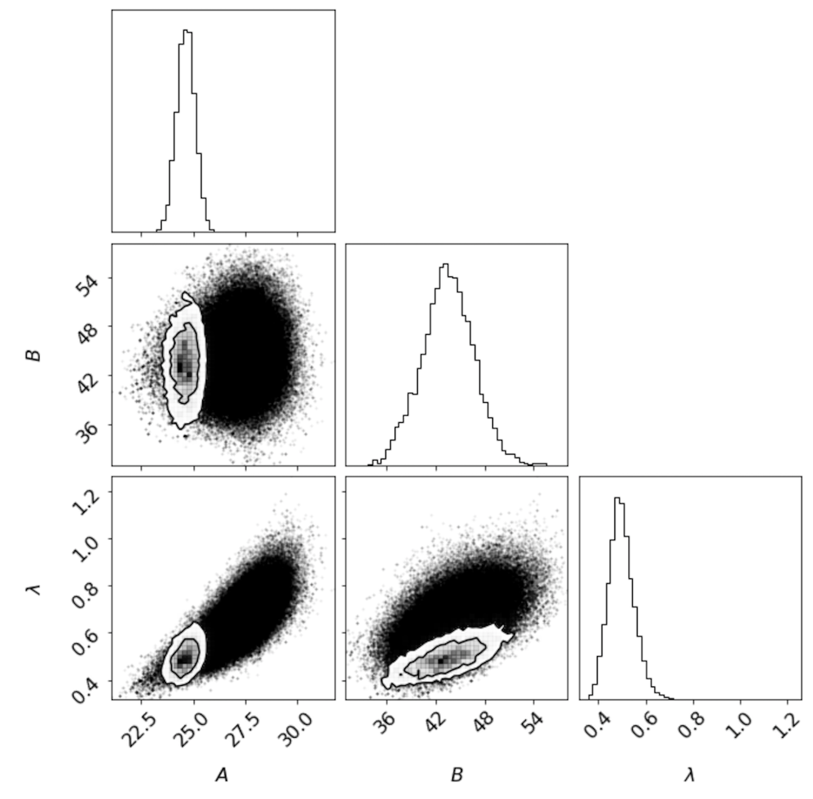
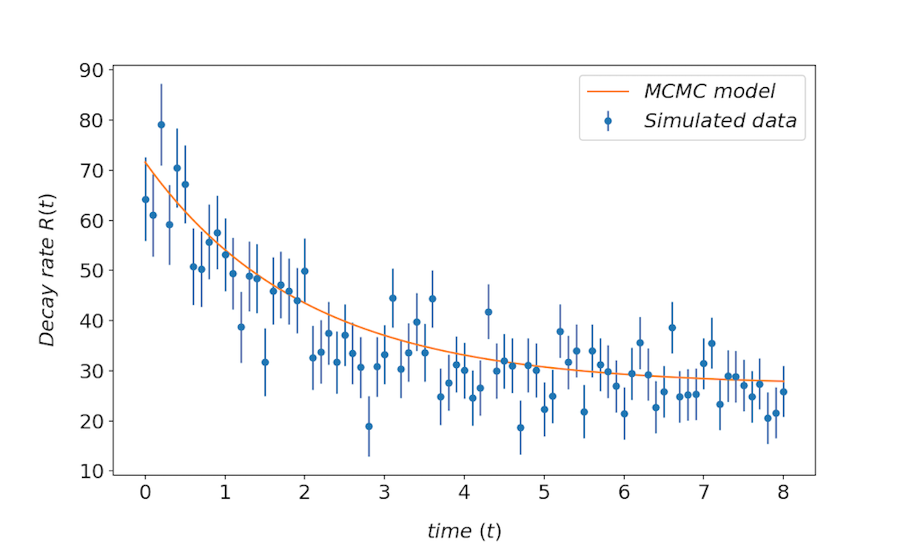

## lwMCMC: lightweight Markov Chain Monte Carlo

---

Parameter space sampling with lightweight MCMC powered by NumPy and Metropolis Hastings.

### Package Layout

* [LICENSE](https://github.com/daniel-furman/lwMCMC/blob/main/LICENSE) - the MIT license, which applies to this package
* README.md - the README file, which you are now reading
* [requirements.txt](https://github.com/daniel-furman/lwMCMC/blob/main/requirements.txt) - prerequisites to install this package, used by pip
* [setup.py](https://github.com/daniel-furman/lwMCMC/blob/main/setup.py) - installer script
* [docs](https://github.com/daniel-furman/lwMCMC/tree/main/docs)/ - contains documentation on package installation and usage
* [examples](https://github.com/daniel-furman/lwMCMC/tree/main/examples)/ - use cases for Bayesian Modeling
* [lwMCMC](https://github.com/daniel-furman/lwMCMC/tree/main/lwMCMC)/ - the library code itself
* [tests](https://github.com/daniel-furman/lwMCMC/tree/main/test)/ - unit tests

### Case 1: Experimental Geophysics Modeling with Bayesian Inference

---

Posterior distributions with  contours | MCMC fit with a slope prior
:---------------------------------:|:----------------------------------------:
 | 

Recovered parameter constraints for a power law flow model for ice compaction in nature via power law creep (see ice creep literature). 

* The grid entries reveal the 1-dimensional posterior distributions of our parameters, as well as the pairwise projections with one and two sigma modeling error contours. 

* With the slope parameters's 1.8 +- 0.225 prior, the Bayesian inferred slope is 1.70 +- 0.17.

### Example 2: Particle Decay Modeling with Bayesian Inference

---

Posterior distributions with  contours | MCMC fit with a  prior
:---------------------------------:|:----------------------------------------:
 | 

Recovered parameter constraints for a particle decay simulation: . 

### `lwMCMC`  Functions 

---

A lwMCMC object has class functions to perform Bayesian inference. 

* define the log(likelihood) function first (not in the class).

To run the chain:
        
* mcmc.stepchain_forward() takes a single step of the chain.

* mcmc.burnout(nburn) runs the chain for nburn steps.

* mcmc.run_forward(nsteps) runs the chain for nsteps steps, saving the results.

* mcmc.ratio_accepted() returns what fraction of the candidate steps
            were taken.
         
            
To manage the results:

* mcmc.clear_chain() clears the MCMC chain

* mcmc.chain_samples() returns the sampled param values in 2d numpy array.

* mcmc.hist_plotter() plots a histogram of the sample values for each
            parameter.
   
* mcmc.sample_plotter() plots the sample values over the course of the 
            chain.
            
* mcmc.calcmean() returns mean of all samples for each parameter.

* mcmc.calccov() returns the covariance matrix of the parameters.
