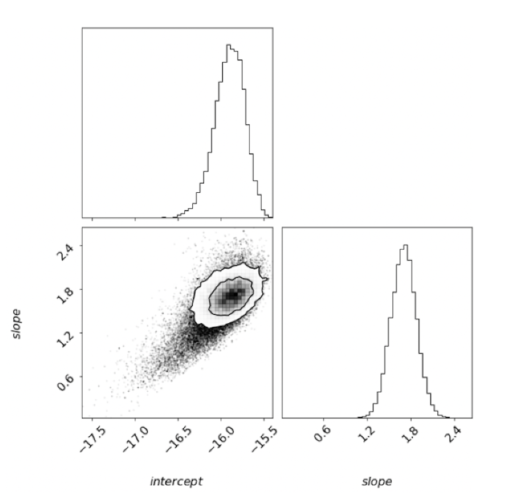

## `lwMCMC` lightweight Markov Chain Monte Carlo

---

Parameter space sampling: lightweight Markov Chain Monte Carlo (MCMC) with the trivial metropolis hastings algorithm. Powered by NumPy. 

### Example 1: Experimental Geophysics Modeling with Laboratory Data

---

Posterior model parameter distributions with  contours | MCMC model with slope prior
:---------------------------------:|:----------------------------------------:
 | 

Recovered parameter constraints for a power law flow model for firn creep (ice compaction in nature). The grid entries reveal the 1-dimensional posterior distributions of our parameters, as well as the pairwise projections with one and two sigma modeling error contours. With the 1.8 +- 0.225 prior on the power law stress exponent, the inferred slope parameter is 1.70 +- 0.17.

## Example 2: Particle Decay Modeling with Simulated Data

---

Posterior distributions with  contours | Decay model with  prior
:---------------------------------:|:----------------------------------------:
 | 

Recovered parameter constraints for a particle decay simulation: . With a prior on A, the inferred decay rate lambda is 0.50 +- 0.05 / sec.

## `lwMCMC` Class Functions 

---

A lwMCMC object has the following class functions:

To run the chain:
        
* mcmc.step() takes a single step of the chain.

* mcmc.burn(nburn) runs the chain for nburn steps.

* mcmc.run(nsteps) runs the chain for nsteps steps, saving the results.

* mcmc.accept_fraction() returns what fraction of the candidate steps
            were taken.
            
Manage the results:

* mcmc.get_samples() returns the sampled param values in 2d numpy array.

* mcmc.plot_hist() plots a histogram of the sample values for each
            parameter.
   
* mcmc.plot_samples() plots the sample values over the course of the 
            chain.
            
* mcmc.calculate_mean() returns mean of all samples for each parameter.

* mcmc.calculate_cov() returns the covariance matrix of the parameters.
